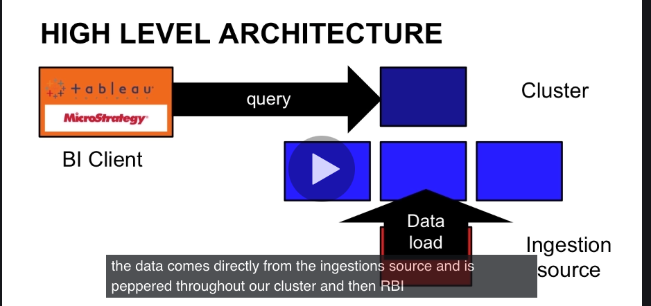
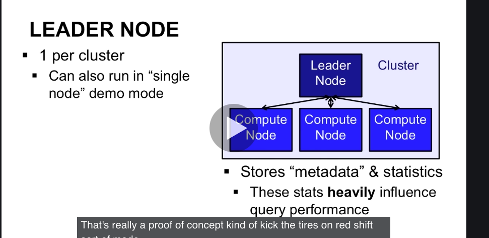
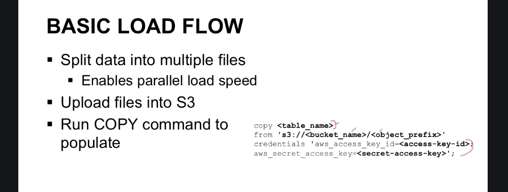
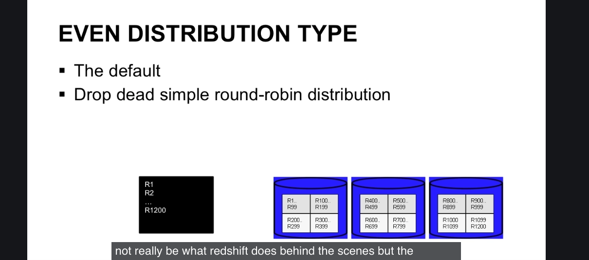

ETL and why we separate OLTP and OLAP
- many fast reads and writes.
- but if people internal start doing BI work and tryign to see the most popular posts or users, who is abusing the system, etc. then problems can occur.
- if these people make long-running queries, and they run several minutes or hours or days, the database locking and table locking, it might interfere and cause system to be slow.
- instead, you should prune OLTP database to be small, and move data to an OLAP.
- how do we prune? we run an etl operation to an OLAP database. OLAP-online analytics processing system.
- so users of OLTP see speed and quick responses and queries and analytics poeple can run longer queries and see speed improvements too.

OLTP vs OLAP
OLTP
disadvantage:
- not meant for heavy volume or to be distributed
- so the upper limit is just a few TB

advantage:
- AKA RDBMS systems
- fast for small insert and update
- typically row-oriented
- heavily normalized
- heavily concurrent

OLAP
known as DW or data warehouse
- purpose: analytics queries on HUGE datasets
- query speed not priority
- only a few dozen or few hundred users at a time. non-concurrent access pattern.
- storage is more the priority.
- few internal users
- data is prematerialzied or use known queries meaning data just sits there waiting for the query, and when query comes, the data is super optimized for that query pattern.
- typically column-oriented
- aggregated data for speed
- hugely scalable

Data Mart:
- there might be contention within the OLAP systems.  marekint and busineses might want different information but are fighting over single OLAP
- separate OLAP to data marts
- data marts- spsecific to business function, data wareshousse for each business function.
- so our ETL from OLTP to datamart might pull specific data for marketing and business to each data mart or two separate data warehouses but business specific.

### what is redshift?
Redshift is OLAP whereas Aurora is OLTP.
joins in a RDMBS or OLTP database would be expensive but OLAP or datawarehouses get around this by prematerializing the data together
- when we pre-materialize data, we load data into cubes.

**what is a data warehouse?**
- columar storage: why? In an analytics database when we analyze the data only interested in a small subset of columns, not all of the columns. So if we have like 100 columns and used row-database, it'd be really slow to read out all of the columns. That'd be slow. 

how to describe dimension and fact tables:
- long table: lots of rows
- skinny: few columns in the table itself.
- short: not dealing with a lot of rows in a table
- wide: may have a lot of columns.
fact tables are in the center and dimension tables in the edges. This is a star schema.
- we usually query the fact table.


**terms to know:**
-data mart
-edw or dw (enterprise data warehouse)
- data cube
- star schema
- facts and dimensions
- columar vs row storage
- etl
queries:
- group by gives you aggregate data

shortcomings of self owned data warehouse:
- eventually we hit a size limit. Our data grows too fast for our OLAP system and it becomes super expensive
- having 6 dimensions of data would push BI into a different licensing tier and a lot more money.
- redshift is a good relatively cheap option for OLAP. Let's look at public cloud data warehouses which are better than self-owned data warehouses
- maintance and upgrading self-owned data warehouse is a pain. multi-day outages due to software and hardware upgrades, replacing failed hardware, etc.
- if we move to cloud, could lower overall costs. we don't need sys admins anymore if we move to cloud.

Benefits of public cloud:
- infinite scale and cpu and ram control is big.
- you don't need sys admins for the on prem system anymore. lower costs. so more time doing software and not infrastructure provisioning work.
- you can tame it once it gets to a certain size with ease. you can even make it go away and spin it up and shut it down when yo udon't need it anymore
- think about if you needed a 300 node data mining workflow. paying for all of this, storing it, installing it, would be so much money. and if you need it only once a year, it sits around all year.
- pay as you go model is great, it's cheaper. scale up or shrink down when we need it.
- but, you give up control, user needs understanding of provisioning, could be more expensive in heavy load scenarios. users need to understand what they are doing (what a cpu is, costs, ram, etc). easy to forget that you left it on until bill arrives too.
- vendor lock in is also a disadvantage, you might become dependent on the vendor. 
- could also increase latency, time to move from one system to another could affect costs. 
- security is good, but if you're like teh NSA you might not be able to use AWS. Nasdaq too.


**Benefits of redshift:**
- low costs. pay per hour, per instance, for every instance (server) in the cluster. as low as $1000 per year per terabyte. using compression, the cost is lower. 
- master slave model, leader node is free
- intra-region backups are free, redshift backs up data to s3 and s3 data is free up to size of redshift cluster size.
- transparent mirroring is free. makes exactly 2 copies of block, chops files into blocks. if you have a 10 tb cluster, it gives you 10 extra tb for free. makes 2.
- monitoring free through cloudwatch service.
- provides columnar storage and automagic compression

**Redshift speed**
- reduced i/o disk and network via compression, columnar storage. transferring less data over network because compression via columnar storage. loading less data into memory too because of columnar storage.
- backups are automatic and transparent
- provision a cluser in 3 minutes
- resizing a cluster to more nodes doesn't bring your cluster down. aws creaets a new cluster with a new leader, puts the old clutser in read-only mode, and copies teh data over.
- deployed into vpc, so it's secure.
- you can load sources of data for Redshift from s3, rds, date pipeline, dynamo, kinesis, emr into Redshift.
- redshift has on demand backups to s3, full snapshot of redshift. never deleted by redshift.

What about disaster recovery?
- does full mirror of all data on 2 drives.
- Kinesis can stream data to 2 different clusters.

**Redshift security**
- security is like an onion, to product stuff in middle
- How is security down: IAM support - can lockdown action by action what users can do. put users into groups and policies to groups or users, policies can say to access only certain schemas.
- policies can be attached to IAM accounts so this limits who can spin up database, delete info, make backups, various API calls.
- encrypted data load to s3 supported if you're like the nasdaq
- vpc support. built for private cloud, gives control into the server
- encrypted SSL, for control and querying data.


- redshift supports native users and groups. controls who can access database and select data, delete data, etc.
- permissions similar to mysql
  
**Logging Redshift**
- native logging of connections of every user, user creation, user actions, user actions (select columns, created tables, etc)
- also cloudtrail integration. cloudtrail is another aws service - lets you log IAM requests. 
- when you turn cloudtrail on all requests are logged like selects, and can be dropped to s3 to do audit logging and so forth. the s3 files logs can be parsed over to do audit logging.
- both logging is free (s3) cloudtrail is free. and native logging is free
- s3 data from cloudtrail is a lot, that is charged at normal rates, not free.

**Redshift monitoring**
- native cloudwatch metrics like cp utilization, number of connections, percent of disk used, health status (up or down), maintanance mode, throughput (rate at which node or cluster receives data), read latency (average amount of time taken for disk read I/O operations), read throughput (average number of bytes read from disk per second). all of this is in the AWS docs for redshift. All of these come from cloudwatch redshift metrics. 
- Inside of redshift, there is query and load performance data you can see summary adn detail information about when cluster is being queries. see if you're getting enough throughput. every minute. 

Redshift is very compatible
- jdbc and odc endpoints
- can write sql, based around postgresql 8.0.2. the leader ndoe exposes postgres interface
- but removes postgresl OLTP single row functions

### How does Pinterest use Redshift
- Pinterest has kafka and mysql pumping data into a data lake = s3. very cheap. s3 is a dumping ground. 
- for data analysis, they would do ETL From s3 to Hadoop. then expose to business users via Hive queries the data in Hadoop. Hive is a wrapper around map-reduce engine inside of Hadoop. exposes sql-like interface into the data.
- that was slow, so they moved to Redshift. You can run sql queries in Redshift. This minimized usage of Hive which didn't allow sql all the time. Much faster REdshift, than Hadoop.
- ETL is everywhere, might cause delays. Presto might be better for ETL, it might be faster.

### How does Redshift use Redshift
- Nasdaq uses Redshift too. 
- For security, also uses VPC, directConnect, Data encryption in flight - (SSL via API & JDBC) so that data packets are encyprted.
- data encryption at rest in s3 and Redshift. also turned on native Redshift 256 encryption
- reduced cost using Redshift 43% down.

### visualizing data
- might be disparate - finance database, social media, sales data, inventory chain, operations, log data (web logs, email logs, chat and phone support)


### Redshift compared to other systems
- vs RDBMS like mySql or Oracle or SQL server. RDBMS have limited size, row based which is inefficient for lookups, self-maintained, but they are faster, better control, ad-hoc access (join tables in different ways). These are OLTP systems. They are complimentary to Redshift.
- vs Presto
- vs Hadoop - includes Hive and Pig which are used to access Hadoop. Hadoop might be slower, self-managed but Hadoop is complex with lots of parameters, expensive, but Hadoop scales better and cheaper at large workloads (100s of terabytes). Scales better than anything though. Hadoop is more of a data lake.
- vs commercial DW  and on-prem - these have big costs, self-managed, might be faster, they are complex though, non-transparent pricing. Examples are Oracle (exadata), Teradata, Neteeza, IBM. benefits: self-managed might be good, could be faster out of the box, better control. Redshift is a replacement.


# Architecture of Redshift
- High level: we have a cluster, 3 minute sto build.
- we have a leader node on top, and worker nodes or compute nodes. 
- BI client, could be remote on my own desktop with a vis tool like Tableau or Looker.
- Ingestion source: loads data from like S3 or dynamo or Redshift. goes directly to worker nodes not leader nodes and peppered throughout client.
- bi client hooks up to leader node and submit queries to leader node.

  
- one leader node per cluster with several compute or worker nodes
- leader node oversees query execution. knows where data is in cluster
- stores metadata and stats
- compute nodes use columnar data storage, leader node uses postgresql 8.0.2. leader node is running postgresql to maintain stats.
- compute nodes keep subset of the data. each node has a subset. act as redundant mirrors of each other. they can execute queries in parallel, they do talk to each other.
- data load to the compute nodes happens in parallel. the ingestion source could be s3. it's super fast since it doesn't go through leader node. movement into compute nodes happens in parallel. files from s3 are chopped up and loaded into redshift compute nodes in parallel so it's fast. 
- from s3, the file gets chopped up to maximize throughput, each bit ends up on compute nodes. every part of a file is sent to a compute node, until all pieces are spread around redshift and mirrored (duplicated)
- leader node comes for free.
- hardware choices: the vCPUs affects the slices.




### Data Loading
- we'll look into slicing and vacuuming
- storage in compute nodes is called slices. and the number of vCPUs = number of slices on a compute node. They are separate storage areas.
- when Redshift analyzes data, it pulls off one core and dedicates core to each slice. each core gets one processing task.
- data on loading is split into multiple files to parallel load speed. first upload files into s3, 
- redshift even has a copy command to pull from s3 into redshift:


the above pulls from s3 into compute nodes directly, not through leader node.
- copy command gives really good throughput, from s3 its fastest. Dynamo is next fastest and EMR.
  - the copy command performs auto data compression on each column you're bringing into Redshift.
- how to split data up? you should have 1 file per slice or vCPU. so if you have 3 ndoes with 32 vCPUs, so 96 slices total, then you should split up a file into 32*3 = 96 files first into s3.

### Vacuum operation
- after a lot of delete/inserts, you have disk fragmenetation, same way on desktop. you should run VACUUM operation after large bulk update, puts data near each other so it can be read quicker. it's like defrag. Move data around on each node slice.

### RDS Sync
- is also a useful tool. Say we have our own data center with binlogs from MYSQL. data can flow from binlogs to redshift. It's real time. can pull data from datastore into Redshift.


### Data distirbution
topics:
- look at 3 types of data distribution
- replicate a star schema
- the goals of data distribution

goals:
- the distribution strategy has important consequences on query performance, storage requirements, data loading, and maintianance.
- you want every node to work as hard as every other node when loading data
- minimize the amount of data transfer during query execution to minimize network lag.
- want to minimize cross node joins and if there's data you want to join, data should be colocated on same node so no network transfer from node1 to node2.

- Data distribution types, attached to table at table creation time. It affects speed of joins and disk usage. and affects how data is tranfered from node to node. 3 types: Even, all, key.

**Even distribution type**
- this is the default. round-robin distribution
- all rows of table are spread evenly around each slice. even number of rows per slice.
- you should do this if you access all data in the table all the time. All of it. If you have a week's worth of data and the queries are for that week, this distribution is good.
- not great for joins or sorting because no sorting is done.



**key distribution type:**
- great for joins.
- rows are distributed according to the vals of one column
- columns that are joined are noted and so the relevant tables are stored together on the same node, possibly different slices on the node. Most imporatntly the two tables are on the same node. This way, we don't have to go across nodes to do joins. when grabbing data, don't have to make network calls to other node.
- commonly joined data is on the same node.
- specify key distribution on common lookup key so that colocation of data happens

all dsitribution type:
- entire table copied to every node. every file, every table is on every node.
- unlike key or even distribution where only a subset of each table's rows exist on a node, every row in All exists on every node.
- slower for updates and inserts and multiples storage amount
- use for small or heavy use tables and frequently joined against and fairly static. not a very rapidly changing table.


### Redshift usage
- Let's look at syntax, expressions, conditions, sql commands (create, insert, update)
- columns, tables, databases must be ASCII characters, digits, underscores,  or dollar sign.
- must start with alphanumeric char or underscore
- recomendation: use _ between letters and use all lowercase

**expressions**
- <exp> <operator> <exp> is basic format
- exp evaluates to a value: sum(lsit) or "365", or avg(col)
- operator: +, or -, or & or XOR or ||

**functions**
- leader node only functions like current schema, now. very limited
- aggregates: count, sum, max
- math: (abs, rand)
-string
- json (array_length)
- bitwise(or, and)

some points about redshift
- no arrays so if you have multiple products per say as a column, they need to be in a char list so the type is still `varchar`.
- you can have multiple sort keys called compound sort keys (multiple sort keys)
- one dist key at creation time


you need to create users with permissions to insert or delete or update.
- start by creating a group: `create group admins`
- then create users: `create user bob with password 'password'`
- create user in group: `create user bob in group admins`
- give permissions: `grant select on retails_ops to GROUP select_only`. the table is retail_ops and the group is select_only
- give all permission: `grant all on retail_ops to bob`
- create group and user: `create group select_only with user bob`

- create database: `create database retails_ops`
- create table: `create retails_ops.pos_data` which is scoped to database
- create table with fields: create table: 
  `create retails_ops.pos_data (
  o_id integer not null,
  o_time timestamp not null,
  store_id integer not null,
  primary key (o_id))`
  

**Insert**
- `insert into <table> values(12345, "some-sku")`

- you can multiple rows: `insert into <table> values (12345, 45, "some-sku"), (123452, 46 "some-sku2")`
- you can add the fields out before vlaues like this: `insert into <table> (o_id, o_time, store_id, products) values (12345, 45, 845, "some-sku"), (123452, 46 "some-sku2")`

**Selects**
- select products from pos_data where store_id=885 and o_date between ('20151201 00:00:00') and ('20151201 00:00:59')

Also can do:
- transactions
- analyze
- alter (group, user, table)
- locks on individual tables if you want nobody interfering like don't allow selects as we're inserting into a table.
- drop


Good sort keys are often the join keys and whichever keys are range keys in where clauses


### Data loading best practices
- redshift does try to create one slice per core so your ideal load leverages 1 s3 file per core
  - so if you have 10 DC.large nodes (2 cores each), how many files? = 20 files should be created in s3.
- split a file into number of vCPUs or multiple of vCPUs.
  - when splitting data you can use `split - 1000 N` command to split a file into 1000 files with equal rows. after split, then compress. 
- compress with gzip after or LZO. LZO good for char and varchar. gzip is nonsplittable.

- when copying data, try to make it from s3. super fast.
- copy at night
- try to sort the copy data in sortkey order so redshift doesn't have to do it.
- Redshift has a workload manager (wlm)
  - cna setup queues, so that queries in one queue get different resources than queries in another queue.
  - `wlm_query_slot_count` parameters controls memory allocation. controls memory allocation


### table design
- distribution key. what should you use?
  - affects where slices go and slice distribution
- sort key
 - can more easily change after the fact. affects how records are on a single slice.

- decide both keys based on queries you are using (the access pattern)
- as query performance changes, reanalyze access pattern

sort key consideration:
- new data is added, data is added. then the zone maps are fragmented. so you need to VACUUM every so often to recalcuate zone maps (min max on each slice) and then run ANALYZE so that leader node is up to date on how to best process queries.
- can specify multiple columns as sort keys.
- add sort keys to columns that are commonly filtered (range, betweens, last day or hours of data)
- also range and equality are good candidates for sort keys.
- join keys are also good candidates


distribution key:
- main goals are to colocate data and distribute query load evenly
- only one dist key per table and cannot change it after table is changed
- use EXPLAIN to see if key is picked right. look at `DS_BCAST` or `DS_DIST`. If there is a `DS_BCAST_INNER` that means entire join table was broadcast to every single slice. `DS_DIST_BOTH` means  entier inner and outer table were broadcast to every slice. both are bad. `DS_DIST_NONE` is good to see.
- for the fact table (the center table that brings together other dimension tables), the dist key should be the one that links the other longest dimension table.
- careful about using ALL as the dist key strategy- it makes a copy of data on every single node. greatly imrpoves query performance at the cost of storage capacity. maybe don't use all on largest tables?
  
- dimension tables are around the edges
- fact table is the table that brings it all together.

```sql
select query, step, rows, workmem, label, is_diskbased
from svl_query_summary
where query = <query_id>
order by workmem desc;
```
this will tell you if a specific query spilled to disk and burst the slice and needed redshift memory to keep going.
